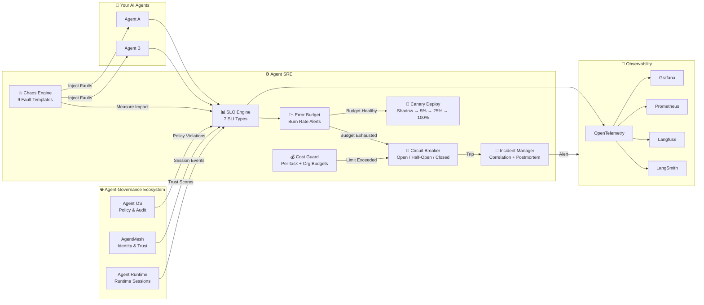

<div align="center">

# Agent SRE

**Reliability Engineering for AI Agent Systems**

*SLOs · Error Budgets · Chaos Testing · Progressive Delivery · Cost Guardrails*

[](https://github.com/microsoft/agent-governance-toolkit/actions/workflows/ci.yml)
[](https://github.com/microsoft/agent-governance-toolkit/blob/main/LICENSE)
[](https://python.org)
[](https://pypi.org/project/agent-governance-python/agent-sre/)

> [!CAUTION]
> **Deprecated package, experimental AI-SDLC surface** — `agent-sre` now emits a
> `DeprecationWarning` and is scheduled for removal in favor of the consolidated
> Agent Governance Toolkit CLI. See the [package migration guide](../package-consolidation/MIGRATION.md).
> The AI-SDLC contracts described below are repository-level experimental APIs and may
> change during that consolidation.

> ⭐ **If this project helps you, please star it!** It helps others discover Agent SRE.

> 🔗 **Part of the [Agent Governance Ecosystem](https://github.com/microsoft/agent-governance-toolkit)** — Works with [Agent OS](https://github.com/microsoft/agent-governance-toolkit) (governance), [AgentMesh](https://github.com/microsoft/agent-governance-toolkit) (identity & trust), and [Agent Runtime](https://github.com/microsoft/agent-governance-toolkit) (runtime sessions)

> 📦 **Install the full stack:** `pip install agent-governance-toolkit[full]` — [PyPI](https://pypi.org/project/ai-agent-governance/) | [GitHub](https://github.com/microsoft/agent-governance-toolkit)

[Quick Start](#quick-start-in-30-seconds) • [Architecture](#architecture-diagram) • [Examples](https://github.com/microsoft/agent-governance-toolkit/tree/main/examples) • [Benchmarks](https://github.com/microsoft/agent-governance-toolkit/blob/main/agent-governance-python/agent-sre/benchmarks/results/BENCHMARKS.md) • [Docs](../index.md) • [Agent OS](https://github.com/microsoft/agent-governance-toolkit) • [AgentMesh](https://github.com/microsoft/agent-governance-toolkit) • [Agent Runtime](https://github.com/microsoft/agent-governance-toolkit)

</div>

### Trusted By — Part of the AgentMesh Governance Ecosystem

<p align="center">
  <a href="https://github.com/langgenius/dify-plugins/pull/2060"></a>
  <a href="https://github.com/run-llama/llama_index/pull/20644"></a>
  <a href="https://github.com/microsoft/agent-governance-python/agent-lightning/pull/478"></a>
  <a href="https://pypi.org/project/langgraph-trust/"></a>
  <a href="https://pypi.org/project/agentmesh-openai-agents-trust/"></a>
  <a href="https://clawhub.ai/microsoft/agentmesh-governance"></a>
</p>

Reliability layer across **170K+ combined GitHub stars** of integrated projects — [Dify](https://github.com/langgenius/dify-plugins/pull/2060) (65K ⭐), [LlamaIndex](https://github.com/run-llama/llama_index/pull/20644) (47K ⭐), [Agent-Lightning](https://github.com/microsoft/agent-governance-python/agent-lightning/pull/478) (15K ⭐), [LangGraph](https://pypi.org/project/langgraph-trust/), [OpenAI Agents](https://pypi.org/project/agentmesh-openai-agents-trust/), and [OpenClaw](https://clawhub.ai/microsoft/agentmesh-governance).

---

## 📊 By The Numbers

<table>
<tr>
<td align="center"><h3>1,257+</h3><sub>Tests Passing</sub></td>
<td align="center"><h3>12+</h3><sub>Framework Adapters<br/><sub>LangChain · CrewAI · AutoGen<br/>LangGraph · Dify · more</sub></sub></td>
<td align="center"><h3>13</h3><sub>Observability Platforms<br/><sub>Langfuse · LangSmith · Arize<br/>Datadog · Prometheus · PagerDuty<br/>Grafana · OTel · more</sub></sub></td>
<td align="center"><h3>OpenTelemetry</h3><sub>Native OTLP Export</sub></td>
</tr>
<tr>
<td align="center"><h3>7</h3><sub>SRE Engines</sub></td>
<td align="center"><h3>9</h3><sub>Chaos Fault Templates</sub></td>
<td align="center"><h3>7</h3><sub>SLI Types</sub></td>
<td align="center"><h3>100%</h3><sub>Test Coverage<br/>on Core Engines</sub></td>
</tr>
</table>

### 💡 Why Agent SRE?

> **The problem:** AI agents fail silently, have no error budgets, and cascading failures propagate unchecked. Your APM says "HTTP 200, all green" while your agent just approved a fraudulent transaction.

> **Our solution:** Apply proven SRE principles to AI agents — SLOs, error budgets, chaos testing, and circuit breakers. The same discipline that keeps Google, Netflix, and Spotify reliable, adapted for non-deterministic agent workloads.

**Built for the $47B AI agent market** — the reliability layer that makes autonomous agents production-ready.

### 🛡️ OWASP Agentic Security Coverage

Agent SRE directly addresses **[OWASP Agentic Security Initiative](../compliance/owasp-asi-policy-mapping.md)** risk **ASI08 — Cascading Agent Failures**:

| OWASP Risk | Agent SRE Coverage |
|---|---|
| **ASI08: Cascading Agent Failures** | Circuit breakers, error budgets, fault isolation, chaos testing to prove resilience |
| **ASI07: Uncontrolled Costs** | Per-task cost limits, org budgets, anomaly detection, auto-throttle, kill switch |
| **ASI09: Lack of Observability** | 7 SLI types, OpenTelemetry export, 11 observability platform integrations |
| **ASI10: Inadequate Testing** | Chaos engineering with 9 fault templates, progressive delivery with shadow & canary |

> See full [OWASP Agentic Top 10 mapping →](../compliance/owasp-asi-policy-mapping.md)

---

<a id="architecture-diagram"></a>

## 🏗️ Architecture Diagram



---

<a id="quick-start-in-30-seconds"></a>

## ⚡ Quick Start in 30 Seconds

```bash
pip install agent-sre
```

```python
from agent_sre import SLO, ErrorBudget
from agent_sre.slo.indicators import TaskSuccessRate, CostPerTask, HallucinationRate

# Define what "reliable" means for your agent
slo = SLO(
    name="my-agent",
    indicators=[
        TaskSuccessRate(target=0.95, window="24h"),
        CostPerTask(target_usd=0.50, window="24h"),
        HallucinationRate(target=0.05, window="24h"),
    ],
    error_budget=ErrorBudget(total=0.05),
)

# After each agent task
slo.indicators[0].record_task(success=True)
slo.indicators[1].record_cost(cost_usd=0.35)
slo.indicators[2].record_evaluation(hallucinated=False)
slo.record_event(good=True)

# Check health
status = slo.evaluate()  # HEALTHY, WARNING, CRITICAL, or EXHAUSTED
print(f"Budget remaining: {slo.error_budget.remaining_percent:.1f}%")
```

That's it. Your agent now has SLOs, error budgets, and burn rate alerts. [See all examples →](https://github.com/microsoft/agent-governance-toolkit/tree/main/examples)

---

## Enterprise AI-SDLC release gates (experimental)

Agent SRE includes an evidence control plane for AI-enabled software changes. It does
not infer completion from task status or prose. It evaluates strict, versioned,
digest-bound artifacts and fails closed when required evidence is missing, stale,
unpriced, incomplete, from an unapproved environment, or bound to a different source
revision.

| Gate | Required outcome |
|---|---|
| **G0 — Intent** | Unambiguous normative requirements, resolved questions and assumptions, acceptance scenarios, and reciprocal traceability |
| **G1 — Architecture** | Accepted ADRs, NFRs, interface contracts, threat model, acyclic tasks, risk tiers, and tool scopes |
| **G2 — Deterministic quality** | Risk-selected build, format, lint, type, test, coverage, mutation, complexity, contract, architecture, and drift reports |
| **G3 — Independent review** | Authenticated whole-change review, runtime-scoped bounded fixes, a final signed clean verdict, and model-provider-family diversity for material changes |
| **G4 — Security and AI safety** | SAST, SCA, secret scan, SBOM, provenance, agent-safety dimensions, tool-manifest reconciliation, human-labelled judge calibration, and policy-evaluated PyRIT evidence when required |
| **G5 — Economics and performance** | Complete known cost and observed performance evidence from the usage ledger; unknown cost is never treated as zero |
| **G6 — Release** | Fresh, source- and policy-bound G0-G5 results plus policy-pinned, signed, risk-selected human approvals |

The canonical `agt.change/v1` contract is the source of truth. Its Markdown files are
generated projections. `OrchestrationPlanner` turns a validated change into a
side-effect-free `agt.orchestration-manifest/v1`: dependency waves, unique fresh
contexts, isolated workspace keys, exact Plane-2 tool policy, benchmark- and
price-backed routes, usage reservations, execution ceilings, an independent review
route, predeclared conditional fix/re-review rounds, protected review-attester trust
anchors, and human checkpoints. Every assignment binds the exact enabled model
deployment and prompt version selected from the central registries.

`GovernedOrchestrationRuntime` executes that immutable manifest through an injected
host adapter. Before each pending assignment it rechecks those model and prompt
records, separately trusted manifest/change/policy digests, the effective-dated
price, and Ed25519-signed checkpoint grants. Before each tool call, the host must
submit canonical action metadata to the runtime: role, tool, action, resource, path
or URL, scopes, optional secret reference, and approval digest. The runtime applies
role allowlists, workspace-root confinement, command/network/secret policy,
checkpoint requirements, and atomic turn/tool/assignment/run cost ceilings, then
durably records authorization before the side effect. The returned untrusted value
must pass result-size, structure, control-character, and blocked-content screening;
the final receipt reconciles one screened audit with every reported tool call.

The runtime also enforces an assignment result-commit deadline. A late synchronous
host result cannot commit, although Python cannot forcibly terminate the underlying
thread. It records inode-pinned, restart-safe SQLite state plus a canonical execution
receipt. Completed work is idempotent across restarts; cancelled and
checkpoint-waiting work can resume without re-running successful assignments.

Privileged `execute`, `network`, or `administrative` task scopes force the tool-agent
risk profile; labeling the same work as documentation or standard risk cannot bypass
G4. The runtime requires signed, scope-correct human grants for privileged calls.
Its mediation API is still a cooperative adapter boundary: a process with ambient
filesystem, network, or secret access can bypass the callback. Production hosts must
use least-privilege process/container isolation and OS-enforced workspace, egress,
DNS/redirect, and secret controls. Agent OS can supply that outer enforcement and
additional factual audit evidence, but it does not replace the runtime's required
per-call audit records.

Every successful review carries an Ed25519 semantic attestation from an identity/key
pair pinned by the protected orchestration policy. A host-generated self-digest or
untrusted `clean` claim is rejected. The short-lived signature binds the exact
manifest, run, change/policy digests, assignment request, context/workspace, model
identity/family, round, report, verdict, and complete finding set, preventing replay
across review invocations. When a signed review reports blockers, the
runtime derives an exact binding from the finding task IDs and paths, invokes only
the predeclared remediation assignment, restricts writes and executes to that finding
scope, records the fix, and runs a fresh whole-change review. The bounded history in
the receipt must end in an authenticated clean verdict; exhausting
`max_review_rounds` fails closed. Release approval is issued afterward and binds the
actual final review outcome and output digests.

`ControlPlaneCatalog` persists model and prompt registries, effective-dated prices,
and benchmark records as canonical, hash-checked SQLite facts with durable enable/
disable and price-supersession transitions, then hydrates a fresh router after
restart. `UsageLedger` supplies multi-scope budgets, reservations, idempotent priced
usage, reconciliation, and rollups whose event-set digest binds the exact events used
at G5/G6. The canonical whole-change cost report partitions exact, disjoint ledger
inventories such as orchestration, CI, and scanner usage, then adds strict external
PyRIT and RAMPART usage facts. Unknown cost, duplicate events, missing risk-required
partitions, or a receipt/ledger mismatch fails closed. Both stores pin database and
directory identities and reject unsafe paths,
symlink replacement, and regular-file rollback swaps; deploy their database
directories under a dedicated service identity with restrictive filesystem
permissions.

Bind the release subject before a PyRIT scenario starts, for example with the
`pyrit_scan run` subject flags or the equivalent API `evidence_subject`. PyRIT then
exports the privacy-safe campaign artifact used by G4:

```bash
pyrit_scan scenario-evidence "$SCENARIO_RESULT_ID" \
  --application "$APPLICATION_ID" \
  --change "$CHANGE_ID" \
  --commit-sha "$GIT_COMMIT" \
  --baseline-scenario-result-id "$BASELINE_RESULT_ID" \
  --output evidence/pyrit-security-evidence.json
```

The three export flags must be supplied together and only assert the immutable
subject stored when the run was created; export and resume cannot attach or relabel a
run. The exporter writes atomically. Release-grade completeness requires an exact
producer-owned trial plan and exact current-run observed inventory. Each observation
binds its atomic identity, origin run, timestamp, cache flag, outcome, and duration;
reused/omitted cached trials, foreign origins, or missing provenance fail closed, and
freshness is derived from the oldest included trial. Partial or unknown usage/cost
remains explicit for policy evaluation. Exit `1` means attack-outcome evidence is
incomplete or unavailable, and `2` means a subject assertion is partial. Agent SRE
authenticates the digest; recomputes atomic/group and overall outcome and nearest-rank
p95 latency facts from observations; and evaluates subject, freshness, usage, cost,
and baseline regressions under `agt.release-policy/v1`. Baselines must satisfy the
same inventory/provenance rules. Policy pins complete benchmark fingerprints—
including the PyRIT version—and independently verified baseline digests with maximum
ages. Project overlays may only narrow those allowlists and freshness windows.

High-risk and tool-agent profiles also require a content-addressed, human-labelled
PyRIT scorer-evaluation report. G4 binds its scorer evaluation hash to the exact
scorer used by the campaign and enforces minimum labelled cases and agreement plus a
maximum false-accept rate. Baseline compatibility is derived again by the consumer
from lifecycle, trial, PyRIT-version, and benchmark facts; a producer cannot suppress
regression checks by merely declaring a comparable baseline incompatible.

Agent SRE also parses the exact current native `rampart.test-run-report/v1` shape,
recomputes aggregate counts from retained raw results, and adapts it into a
source/change-bound `agt.rampart-safety-report/v1` envelope. The protected enterprise
profile pins a canonical campaign digest and per-dimension minimum. Every expected
case binds its pytest node ID, result index, definition-file hashes, dimension,
strategy, and required observability; the native report must cover that inventory
exactly and retain turns for completed outcomes. A policy-pinned Ed25519 RAMPART
issuer signs the exact campaign, native report, usage, source subject, run, producer,
environment, and freshness window. G4 consumes that authenticated envelope and the
central cost report carries its exact report and usage digests. A hand-authored
summary with the right dimension names is not equivalent native RAMPART evidence.

G6 requires an organization-owned `agt.risk-classification/v1` record signed over
the exact change digest, source revision, changed paths, signals, required risk class,
and expiry. The classifier public key comes from protected enterprise policy. A
project's declared risk class does not by itself select a shallower gate profile.
Every required `agt.human-approval/v1` is likewise Ed25519-signed by an issuer whose
identity, public key, and allowed roles are pinned in the enterprise policy. The
signature binds the exact source revision, change and enterprise-policy digests,
risk tier, approver, role, decision, issue time, and expiry. An embedded key or
self-digest is not an approval trust anchor.

For a standalone PyRIT gate, `agent-sre release evaluate` may sign only a passing,
currently reproducible verdict; signing rejects the reproducibility-only
`--evaluated-at` override. `agent-sre release verify` requires the protected policy
and evidence again, plus an independently pinned key (literal hex or an absolute,
non-symlink key-file path). It re-evaluates current freshness and authenticates the
sidecar timestamp, raw-input expiry, and signer identity as part of the Ed25519 payload.
Use `sdlc issue`/`sdlc verify` when the full G0-G6 change and policy context is
required.

Passing G6 creates an **unsigned readiness assessment**, not authorization by itself.
The protected issuance job reloads the canonical change and effective organization
policy, checks separately pinned change and effective-policy digests, and reproduces
the readiness result from raw command evidence, the mandatory manifest and final
receipt, signed risk classification, strict PyRIT evidence, and approvals. It then
evaluates every gate again at the actual signing time, rejecting evidence, review
attestations, or approvals that no longer validate. The signed readiness claims carry
the development, enterprise, release, orchestration, and combined effective-policy
bindings.

The Ed25519 sidecar authenticates the artifact hash, readiness digest, public key,
signing time, and signer identity together. Deployment verification fails closed
unless it receives the independently pinned public key, expected canonical change,
effective policy, and their protected digests; it also checks the policy-selected
release audience, current freshness, and approval expiry. This prevents a valid
release from being replayed into a different audience, application, repository,
revision, change, or policy context.

The issued sidecar carries the earliest expiry of every command report, PyRIT run,
baseline, signed risk classification, review semantic attestation, final release
checkpoint, signed approval, and readiness evaluation that supported issuance.
Verification rejects the release once any one of those signed inputs would have
expired, even when the readiness bundle itself is still young.

> [!WARNING]
> A self-digest proves integrity, not who produced an artifact. Run evaluation and
> issuance only in a protected CI identity, resolve organization policies and trust
> anchors from protected configuration, and fetch command evidence and signed
> approvals from immutable authenticated artifact/IdP records. The `producer` and
> `environment` strings are audit claims; a signed `approver` claim is trustworthy
> only through a policy-pinned issuer authorized for that role. None substitute for
> CI workload identity or provenance. Each required command
> report carries a claimed SHA-256 digest; the protected CI store remains responsible
> for authenticating the producer and serving bytes that match that claim.
> The SQLite append-only triggers and record hashes likewise detect accidental or
> out-of-band mutation by ordinary readers; they do not authenticate a process that
> already has arbitrary database write authority. Treat database ACLs, backups, and
> service identity as part of the control-plane trust boundary.

> [!IMPORTANT]
> A manifest or checkpoint grant alone is not permission for a particular call. The
> host must obtain a runtime authorization for the exact action immediately before
> the side effect and screen the exact result afterward. The receipt proves those
> callbacks occurred; it cannot prove a privileged adapter lacked an unmediated path
> around them. Enforce least privilege outside the Python process as well.

Run the fully offline, self-checking
[enterprise AI-SDLC example](../../examples/enterprise-ai-sdlc/README.md) to generate
the canonical change tree, orchestration manifest, G0-G6 readiness bundle, and signed
release artifact without network or model calls. Its README also lists the focused CI
test, lint, type-check, and demo commands. For protected reusable-workflow handoff,
follow the [enterprise evidence workflow operations guide](../operations/enterprise-ai-sdlc-evidence-workflow.md).

---

## The Problem

AI agents in production fail differently than traditional services:

| Failure Mode | Traditional Service | AI Agent |
|---|---|---|
| **Crash** | Stack trace, restart | Same — but rare |
| **Wrong answer** | N/A | Returns "success" but the answer is wrong |
| **Silent degradation** | Latency spike | Reasoning quality drops, no metric moves |
| **Cost explosion** | Predictable | Runaway tool loops burn $10K in minutes |
| **Cascade failure** | Service A → B | Agent A trusts Agent B who hallucinates |
| **Tool drift** | API versioning | MCP server schema changes silently break workflows |

Your APM dashboard says "HTTP 200, latency 150ms, all green" while your agent just approved a fraudulent transaction.

**Traditional monitoring catches crashes. Agent SRE catches *everything else*.**

## The Solution

Agent SRE brings Site Reliability Engineering to AI agents — the same discipline that keeps Google, Netflix, and Spotify reliable, adapted for non-deterministic agent workloads.

```
┌─────────────────────────────────────────────────────────────────┐
│                      Your AI Agents                             │
├─────────────────────────────────────────────────────────────────┤
│  Agent SRE — The Reliability Lifecycle                          │
│                                                                 │
│  1. DEFINE    SLOs — what does "reliable" mean?                  │
│  2. MEASURE   SLIs — are we meeting those targets?              │
│  3. PROTECT   Cost Guard + Circuit Breaker — prevent disasters  │
│  4. SHIP      Shadow + Canary — deploy changes safely           │
│  5. BREAK     Chaos Engine — prove resilience before prod does  │
│  6. RESPOND   Incidents + Postmortem — recover fast             │
│  7. LEARN     Replay + Diff — understand exactly what happened  │
├─────────────────────────────────────────────────────────────────┤
│  AgentMesh — Identity, Trust, Routing                           │
├─────────────────────────────────────────────────────────────────┤
│  Agent OS — Policy Enforcement, Audit, Compliance               │
└─────────────────────────────────────────────────────────────────┘
```

---

## Core Capabilities

### 1. SLO Engine — Define What "Reliable" Means

Traditional SRE defines SLOs for services (99.9% uptime). Agent SRE defines SLOs for *agent behavior*:

| SLI (Indicator) | Example SLO | What It Catches |
|---|---|---|
| **Task Success Rate** | 99.5% of tasks correct | Silent reasoning failures |
| **Tool Call Accuracy** | 99.9% correct tool selection | Wrong tool, wrong arguments |
| **Response Latency (P95)** | < 5s single-step | Stuck in reasoning loops |
| **Cost Per Task** | < $0.50 mean | Runaway tool loops |
| **Policy Compliance** | 100% adherence | Safety violations |
| **Scope Chain Depth** | ≤ 3 hops | Unbounded delegation |
| **Hallucination Rate** | < 1% factual errors | Confident wrong answers |

```python
from agent_sre import SLO, ErrorBudget
from agent_sre.slo.indicators import TaskSuccessRate, CostPerTask, HallucinationRate

slo = SLO(
    name="customer-support-agent",
    indicators=[
        TaskSuccessRate(target=0.995, window="30d"),
        CostPerTask(target_usd=0.50, window="24h"),
        HallucinationRate(target=0.05, window="24h"),
    ],
    error_budget=ErrorBudget(
        total=0.005,
        burn_rate_alert=2.0,      # Alert at 2x normal burn
        burn_rate_critical=10.0,  # Page at 10x burn
    )
)

slo.record_event(good=True)
status = slo.evaluate()  # HEALTHY | WARNING | CRITICAL | EXHAUSTED
```

### 2. Replay Engine — Time-Travel Debugging for Agents

Capture every decision point and replay it exactly:

```python
from agent_sre.replay.capture import TraceCapture, SpanKind, TraceStore

# Capture mode: records all decisions, tool calls, costs
with TraceCapture(agent_id="support-bot-v3", task_input="Refund order #12345") as capture:
    span = capture.start_span("tool_call", SpanKind.TOOL_CALL,
                              input_data={"tool": "lookup_order", "order_id": "12345"})
    span.finish(output={"status": "found", "amount": 49.99}, cost_usd=0.02)

    span = capture.start_span("llm_inference", SpanKind.LLM_INFERENCE,
                              input_data={"prompt": "Process refund for $49.99"})
    span.finish(output={"decision": "approve_refund"}, cost_usd=0.15)

# Save trace, replay later, diff with production
store = TraceStore()
store.save(capture.trace)
```

Features: deterministic replay, trace diffing, what-if analysis, multi-agent distributed traces, automatic PII redaction.

### 3. Progressive Delivery — Ship Agent Changes Safely

```yaml
# agent-sre.yaml — GitOps deployment spec
apiVersion: agent-governance-python/agent-sre/v1
kind: AgentRollout
metadata:
  name: support-bot-v4
spec:
  strategy:
    type: canary
    steps:
      - shadow: 100%     # Route all traffic to v4 in preview mode
        duration: 1h
        analysis:
          - metric: task_success_rate
            threshold: 0.99
      - canary: 5%        # 5% real traffic to v4
        duration: 2h
        analysis:
          - metric: response_quality_score
            threshold: 0.95
          - metric: cost_per_task
            max_increase: 20%
      - canary: 25%
        duration: 4h
      - canary: 100%      # Full rollout
    rollback:
      automatic: true
      on:
        - error_budget_burn_rate > 5.0
        - policy_violations > 0
        - cost_anomaly_detected
```

### 4. Chaos Engineering — Break Agents on Purpose

```python
from agent_sre.chaos.engine import ChaosExperiment, Fault, AbortCondition

experiment = ChaosExperiment(
    name="tool-failure-resilience",
    target_agent="research-agent",
    faults=[
        Fault.tool_timeout("web_search", delay_ms=30_000),
        Fault.tool_error("database_query", error="connection_refused", rate=0.5),
        Fault.llm_latency("openai", p99_ms=15_000),
        Fault.delegation_reject("analyzer", rate=0.1),
    ],
    duration_seconds=1800,
    abort_conditions=[
        AbortCondition(metric="task_success_rate", threshold=0.80, comparator="lte"),
        AbortCondition(metric="cost_per_task", threshold=5.00, comparator="gte"),
    ],
)

experiment.start()
for fault in experiment.faults:
    experiment.inject_fault(fault, applied=True)

resilience = experiment.calculate_resilience(
    baseline_success_rate=0.98,
    experiment_success_rate=0.88,
    recovery_time_ms=2500,
)
print(f"Fault Impact Score: {resilience.overall:.0f}/100")
```

9 pre-built experiment templates: tool timeout, error storms, LLM degradation, cascading failures, cost explosions, and more.

### 5. Cost Guard — Prevent $10K Surprises

```python
from agent_sre.cost.guard import CostGuard

guard = CostGuard(
    per_task_limit=2.00,          # Hard cap per task
    per_agent_daily_limit=100.00, # Per agent per day
    org_monthly_budget=5000.00,   # Organization total
    anomaly_detection=True,       # Alert on unusual patterns
    auto_throttle=True,           # Slow down agents approaching limits
    kill_switch_threshold=0.95,   # Kill at 95% budget
)

# Before each task
allowed, reason = guard.check_task("my-agent", estimated_cost=0.50)
if not allowed:
    print(f"Blocked: {reason}")

# After each task
alerts = guard.record_cost("my-agent", "task-42", cost_usd=0.35)
for alert in alerts:
    print(f"⚠️ {alert.severity.value}: {alert.message}")
```

Anomaly detection uses Z-score, IQR, and EWMA methods with severity scoring.

### 6. Incident Manager — When Agents Fail in Production

```python
from agent_sre.incidents.detector import IncidentDetector, Signal, SignalType

detector = IncidentDetector(correlation_window_seconds=300)

# Register automated responses
detector.register_response("slo_breach", ["manual_rollback", "notify_oncall"])
detector.register_response("cost_anomaly", ["throttle_agent", "create_postmortem_template"])

# Ingest signals from your monitoring
signal = Signal(
    signal_type=SignalType.ERROR_BUDGET_EXHAUSTED,
    source="support-agent",
    message="Error budget consumed — freeze deployments",
)

incident = detector.ingest_signal(signal)
if incident:
    print(f"🚨 {incident.severity.value}: {incident.title}")
```

Features: signal correlation, deduplication, circuit breaker per agent, automated runbook execution, postmortem generation with timeline and action items.

---

## Ecosystem Integration

Agent SRE completes the governance-to-reliability stack:

| Layer | Project | What It Does |
|---|---|---|
| **Reliability** | **Agent SRE** (this) | SLOs, chaos testing, canary deploys, cost guard, replay |
| **Runtime** | [Agent Runtime](https://github.com/microsoft/agent-governance-toolkit) | Session isolation, execution rings, saga orchestration |
| **Networking** | [AgentMesh](https://github.com/microsoft/agent-governance-toolkit) | Identity, trust, routing, delegation |
| **Kernel** | [Agent OS](https://github.com/microsoft/agent-governance-toolkit) | Policy enforcement, audit, compliance |

### With Agent OS
- Policy violations → SLO breaches (every violation counts against error budget)
- Audit trail → Replay engine (raw data for deterministic replay)
- Preview mode → Progressive delivery pipeline

### With AgentMesh
- Trust scores → SLI indicators (mesh trust becomes an SLI)
- Scope chains → Distributed traces (every hop is a span)
- Identity rotation → Deployment events (tracked as reliability events)

### With OpenTelemetry
- Native OTLP export for all SLIs and traces
- Custom semantic conventions for agent-specific telemetry
- Compatible with Grafana, Prometheus, Jaeger, and other OTLP-compatible backends

---

## Architecture

```
agent-governance-python/agent-sre/
├── src/agent_sre/
│   ├── slo/               # SLO definitions, SLI collectors, error budgets
│   │   ├── indicators.py  # 7 built-in SLIs (task success, cost, hallucination, etc.)
│   │   ├── objectives.py  # SLO engine with burn rate alerts
│   │   └── dashboard.py   # SLO dashboard with compliance history
│   ├── replay/            # Deterministic capture and replay engine
│   │   ├── capture.py     # Trace capture with PII redaction
│   │   ├── engine.py      # Replay, diff, trace comparison
│   │   ├── visualization.py  # Execution graphs, critical path
│   │   └── distributed.py # Multi-agent trace reconstruction
│   ├── delivery/          # Progressive delivery (shadow, canary, rollback)
│   │   ├── rollout.py     # Preview mode, staged rollouts, traffic splitting
│   │   └── gitops.py      # Declarative rollout specs (YAML)
│   ├── chaos/             # Chaos engineering and fault injection
│   │   ├── engine.py      # Experiment state machine, fault impact scoring
│   │   └── library.py     # 9 pre-built experiment templates
│   ├── cost/              # Cost tracking, budgets, anomaly detection
│   │   ├── guard.py       # Hierarchical budgets, auto-throttle, kill switch
│   │   └── anomaly.py     # Z-score, IQR, EWMA anomaly detection
│   ├── incidents/         # Detection, response, postmortem generation
│   │   ├── detector.py    # Signal correlation, deduplication, routing
│   │   ├── circuit_breaker.py  # Per-agent circuit breaker (CLOSED/OPEN/HALF_OPEN)
│   │   └── postmortem.py  # Postmortem template with timeline + action items
│   ├── integrations/      # Ecosystem bridges
│   │   ├── agent_os/      # Agent OS policy + audit → SLI bridge
│   │   ├── agent_mesh/    # AgentMesh trust score → SLI bridge
│   │   ├── otel/          # OpenTelemetry export
│   │   ├── langchain/     # LangChain callback handler
│   │   ├── llamaindex/    # LlamaIndex callback handler
│   │   ├── langfuse/      # Langfuse SLO scoring + cost export
│   │   ├── langsmith/     # LangSmith trace + feedback export
│   │   ├── arize/         # Arize/Phoenix span export
│   │   ├── braintrust/    # Braintrust eval + experiment export
│   │   ├── helicone/      # Helicone header injection + logging
│   │   ├── datadog/       # Datadog metrics + events export
│   │   ├── agentops/      # AgentOps session + event recording
│   │   ├── prometheus/    # Prometheus /metrics text format
│   │   └── mcp/           # MCP drift detection
│   ├── mcp/               # MCP server (agent self-monitoring tools)
│   ├── cli/               # CLI tool (agent-sre command)
│   └── alerts/            # Webhook alerting (Slack, PagerDuty, OpsGenie, Teams)
├── dashboards/            # Pre-built Grafana dashboards
├── operator/              # Kubernetes CRDs (AgentSLO, CostBudget)
├── .github/actions/       # GitHub Actions (canary deployment)
├── examples/              # 4 runnable demos
├── tests/                 # 1,257 tests
├── docs/                  # Getting started, concepts, integration guide
└── specs/                 # SLO templates (coming soon)
```

---

## How It Differs

**Observability tools** (LangSmith, Langfuse, Arize) tell you *what happened*.
Agent SRE tells you *if it was within budget* and *what to do about it*.

| | Observability Tools | Agent SRE |
|---|---|---|
| Tracing | ✅ Core strength | ✅ Trace capture + deterministic replay |
| Evaluation | ✅ LLM-as-judge | ✅ SLI recording |
| **SLOs & Error Budgets** | ❌ | ✅ Define reliability targets |
| **Canary Deployments** | ❌ | ✅ Compare agent versions safely |
| **Chaos Testing** | ❌ | ✅ Inject faults, measure resilience |
| **Cost Guardrails** | ❌ (cost tracking only) | ✅ Per-task limits, auto-throttle, kill switch |
| **Incident Detection** | ❌ | ✅ SLO breach → auto-incident → postmortem |
| **Progressive Rollout** | ❌ | ✅ Preview mode, traffic splitting, rollback |

**Use both together:** observability for deep trace debugging, Agent SRE for production reliability operations.

**AI-powered SRE tools** (Cleric, Resolve, SRE.ai) use AI to help humans debug *infrastructure*. Agent SRE applies SRE principles *to AI agent systems*. Completely different target.

**Traditional APM** (Prometheus, Grafana, Jaeger) monitors infrastructure. Your dashboard says "HTTP 200, latency 150ms, all green" while your agent just approved a fraudulent transaction. Agent SRE catches reasoning failures, not infrastructure failures.

---

## Status & Maturity

### ✅ Fully Implemented (20,000+ lines, 1,257 tests)

| Component | Status | Description |
|---|---|---|
| **SLO Engine** | ✅ Stable | 7 SLI types, error budgets, burn rate alerts, auto-fire to AlertManager |
| **Replay Engine** | ✅ Stable | Capture, replay, diff, trace comparison, distributed traces |
| **Progressive Delivery** | ✅ Stable | Shadow mode evaluation, canary rollout lifecycle, analysis gates, automatic rollback |
| **Chaos Engine** | ✅ Stable | 9 fault templates, fault impact scoring, abort conditions |
| **Cost Guard** | ✅ Stable | Hierarchical budgets, anomaly detection, auto-throttle |
| **Incident Manager** | ✅ Stable | Signal correlation, circuit breaker, postmortem generation, runbook execution |
| **Agent OS Bridge** | ✅ Stable | Policy violations → SLI, audit entries → signals |
| **AgentMesh Bridge** | ✅ Stable | Trust scores → SLI, mesh events → signals |
| **OpenTelemetry** | ✅ Stable | Full span/metric export with OTEL SDK |
| **LangChain Callbacks** | ✅ Stable | Duck-typed callback handler for SLI collection |
| **LlamaIndex Callbacks** | ✅ Stable | Query/retriever/LLM tracking for RAG pipelines |
| **Langfuse** | ✅ Stable | SLO scoring and cost observation export |
| **LangSmith** | ✅ Stable | Run tracing and evaluation feedback export |
| **Arize/Phoenix** | ✅ Stable | Phoenix span export + evaluation import |
| **Braintrust** | ✅ Stable | Eval-driven monitoring and experiment export |
| **Helicone** | ✅ Stable | Header injection for proxy-based cost/latency tracking |
| **Datadog** | ✅ Stable | Metrics and events export for LLM monitoring |
| **AgentOps** | ✅ Stable | Session recording and event tracking |
| **W&B** | ✅ Stable | Experiment tracking with SRE metrics |
| **MLflow** | ✅ Stable | Experiment logging with SLO data |
| **Prometheus** | ✅ Stable | Native `/metrics` endpoint + Grafana dashboards |
| **MCP Drift Detection** | ✅ Stable | Tool schema fingerprinting, change severity classification |
| **MCP Server** | ✅ Stable | Agent self-monitoring tools (SLO check, cost budget, rollout status) |
| **Webhook Alerting** | ✅ Stable | Slack, PagerDuty, OpsGenie, Microsoft Teams + deduplication |
| **Alert Persistence** | ✅ Stable | SQLite-backed alert history for audit trail |
| **Framework Adapters** | ✅ Stable | LangGraph, CrewAI, AutoGen, OpenAI Agents SDK, Semantic Kernel, Dify |
| **CLI Tool** | ✅ Stable | `agent-sre` CLI for SLO status, cost summary, system info |
| **GitHub Actions** | ✅ Stable | Canary deployment action for CI/CD pipelines |
| **K8s CRDs** | ✅ Stable | AgentSLO and CostBudget custom resource definitions |
| **LLM-as-Judge Evals** | ✅ Stable | RulesJudge + JudgeProtocol, 5 criteria, 3 suite presets |
| **SLO Templates** | ✅ Stable | 4 domain-specific templates (support, coding, research, pipeline) |
| **REST API** | ✅ Stable | Zero-dependency HTTP API for SLO status, incidents, cost, traces |
| **Fleet Management** | ✅ Stable | Multi-agent registry, heartbeats, aggregate health, filtering |
| **Helm Chart** | ✅ Stable | Deployment, Service, CRD templates with configurable values |
| **Benchmark Suite** | ✅ Stable | 10 scenarios across 6 categories with scoring and reporting |
| **Certification** | ✅ Stable | Bronze/Silver/Gold reliability tiers with evidence-based evaluation |
| **A/B Testing** | ✅ Stable | Experiment engine with Welch's t-test and traffic splitting |
| **Protocol Tracing** | ✅ Stable | A2A/MCP-aware distributed tracing with W3C context propagation |

---

## Examples

| Example | Description | Command |
|---|---|---|
| [Quickstart](https://github.com/microsoft/agent-governance-toolkit/blob/main/agent-governance-python/agent-sre/examples/quickstart.py) | SLO + cost + incident in one script | `python examples/quickstart.py` |
| [LangChain Monitor](https://github.com/microsoft/agent-governance-toolkit/blob/main/agent-governance-python/agent-sre/examples/langchain_monitor.py) | LangChain RAG agent with SLOs and evaluations | `python examples/langchain_monitor.py` |
| [Cost Guard](https://github.com/microsoft/agent-governance-toolkit/blob/main/agent-governance-python/agent-sre/examples/cost_guard.py) | Budget enforcement with throttling | `python examples/cost_guard.py` |
| [Canary Rollout](https://github.com/microsoft/agent-governance-toolkit/blob/main/agent-governance-python/agent-sre/examples/canary_rollout.py) | Preview + staged rollout with manual rollback | `python examples/canary_rollout.py` |
| [Chaos Test](https://github.com/microsoft/agent-governance-toolkit/blob/main/agent-governance-python/agent-sre/examples/chaos_test.py) | Fault injection and fault impact scoring | `python examples/chaos_test.py` |

**Docker:**

```bash
docker compose up quickstart          # Quick demo
docker compose up langchain-monitor   # LangChain + SLOs + LLM-as-Judge
docker compose up api                 # REST API on port 8080
```

**Kubernetes:**

```bash
helm install agent-sre ./deployments/helm/agent-sre
```

### REST API

Full FastAPI REST API with 27 endpoints and interactive Swagger docs:

```bash
pip install agent-sre[api]
uvicorn agent_sre.api.server:app
# Open http://localhost:8000/docs for Swagger UI
```

Endpoints: SLOs, Cost, Chaos, Incidents, Delivery, Health, Metrics.

### Visualization Dashboard

Interactive Streamlit dashboard with 5 tabs:

```bash
cd examples/dashboard
pip install -r requirements.txt
streamlit run app.py
```

Tabs: SLO Health | Cost Management | Chaos Engineering | Incidents | Progressive Delivery

---

## Documentation

- [Getting Started](https://github.com/microsoft/agent-governance-toolkit/blob/main/agent-governance-python/agent-sre/docs/getting-started.md) — Install and define your first SLO in 5 minutes
- [Deployment Guide](https://github.com/microsoft/agent-governance-toolkit/blob/main/agent-governance-python/agent-sre/docs/deployment.md) — Docker, integration patterns, production checklist
- [Security Model](https://github.com/microsoft/agent-governance-toolkit/blob/main/agent-governance-python/agent-sre/docs/security.md) — Threat model, attack vectors, best practices
- [Concepts](https://github.com/microsoft/agent-governance-toolkit/blob/main/agent-governance-python/agent-sre/docs/concepts.md) — Why agent reliability is different from infrastructure reliability
- [Integration Guide](https://github.com/microsoft/agent-governance-toolkit/blob/main/agent-governance-python/agent-sre/docs/integration-guide.md) — Use with Agent OS, AgentMesh, and OpenTelemetry
- [Comparison](https://github.com/microsoft/agent-governance-toolkit/blob/main/agent-governance-python/agent-sre/docs/comparison.md) — Detailed comparison with other tools

---

## Frequently Asked Questions

**Why do AI agents need SRE?**
AI agents in production are services that can fail, degrade, or cost too much -- just like any other service. Agent SRE applies proven Site Reliability Engineering practices (SLOs, error budgets, chaos testing, staged rollouts) specifically to AI agent systems, catching reliability issues before they impact users.

**How does chaos engineering work for AI agents?**
Agent SRE injects failures like increased latency, dropped responses, corrupted outputs, and resource exhaustion at specific points in agent workflows. It measures impact on SLOs, triggers automated rollbacks when error budgets are exceeded, and provides replay debugging to analyze failure cascades.

**What SLOs can I define for AI agents?**
Agent SRE supports SLOs for response time, accuracy, cost per inference, safety compliance, and custom metrics. Each SLO has an error budget that burns down when violated. Burn rate alerts notify you before the budget is exhausted, enabling proactive intervention.

**How does Agent SRE integrate with existing monitoring?**
Agent SRE exports metrics via OpenTelemetry and Prometheus. It integrates with 11 observability platforms (Langfuse, LangSmith, Arize, Datadog, AgentOps, W&B, MLflow, and more). It's part of the [Agent Governance Ecosystem](https://github.com/microsoft/agent-governance-toolkit) with 4,310+ tests across 4 repos.

---

## Contributing

```bash
git clone https://github.com/microsoft/agent-governance-toolkit.git
cd agent-sre
pip install -e ".[dev]"
pytest
```

See [CONTRIBUTING.md](https://github.com/microsoft/agent-governance-toolkit/blob/main/CONTRIBUTING.md) for guidelines.

## 🗺️ Roadmap

| Quarter | Milestone |
|---------|-----------|
| **Q1 2026** | ✅ Core 7 engines, OTel integration, Prometheus dashboards |
| **Q1 2026** | ✅ PagerDuty alerting, Grafana SLO dashboards, org budget enforcement, bounded ErrorBudget events |
| **Q2 2026** | Kubernetes operator, OpsGenie integration |
| **Q3 2026** | ML-powered anomaly detection, auto-remediation |
| **Q4 2026** | Managed cloud service, SOC2 compliance automation |

## License

MIT — See [LICENSE](https://github.com/microsoft/agent-governance-toolkit/blob/main/LICENSE) for details.

---

<div align="center">

**Observability tells you what happened. Agent SRE tells you if it was within budget.**

---

### 🌐 Agent Governance Ecosystem

| Package | Role |
|---------|------|
| **Agent OS** | Policy engine — deterministic action evaluation |
| **AgentMesh** | Trust infrastructure — identity, credentials, protocol bridges |
| **Agent Runtime** | Execution supervisor — rings, sessions, sagas |
| **Agent SRE** | Reliability — SLOs, circuit breakers, chaos testing *(this package)* |
| **Agent Compliance** | Regulatory compliance — GDPR, HIPAA, SOX frameworks |
| **Agent Marketplace** | Plugin lifecycle — discover, install, verify, sign |
| **Agent Lightning** | RL training governance — governed runners, policy rewards |

[GitHub](https://github.com/microsoft/agent-governance-toolkit) · [Docs](../index.md) · [PyPI](https://pypi.org/project/agent-governance-python/agent-sre/) · [Discussions](https://github.com/microsoft/agent-governance-toolkit/discussions) · [Sponsor](https://github.com/microsoft/agent-governance-toolkit)

</div>
